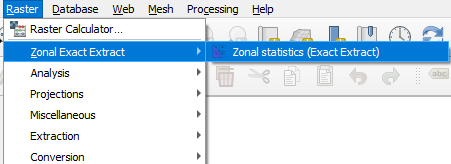
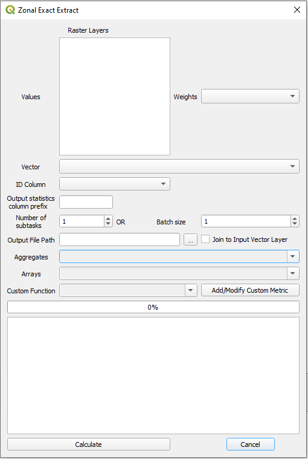

<h1 align="center">
	QGIS Zonal ExactExtract
</h1>

<h3 align="center">
	Plugin for QGIS to calculate zonal statistics using <a href="https://github.com/isciences/exactextract/tree/master">exactextract</a> library
</h3>

<p align="center">
	<strong>
		<a href="placeholder">Docs</a>
		•
		<a href="placeholder">Demo</a>
	</strong>
</p>

<p align="center">



</p>

## Overview
This is a repository for the QGIS plugin that allows to aggregate/summarize values of the raster over polygonal (vector) areas using ``exactextract`` library. This library allows to treat pixel cells as partially covered by polygons using weighting according to the extent of cover. If you want to know more about the library working in the backend of this plugin it's highly recommend to visit its <a href="https://github.com/isciences/exactextract/tree/master"> github repository</a>.

The geoprocessesing tool "Zonal statistics" currently implemented in QGIS have an issues (<a href="https://github.com/qgis/QGIS/issues/52223">1</a>, <a href="https://github.com/qgis/QGIS/issues/38273">2</a>) that yield wrong results in certain situations. Exactextract can *remedy* it.

### Features
- **Multiple supported statistics**: Every statistic given by ``exactextract`` is supported by plugin (<a href="https://github.com/isciences/exactextract?tab=readme-ov-file#supported-statistics">statistics</a>), including array result type (usage of these statistics might slow down calculation and saving stage) and weighted statistics (statistics with `weighted_` name).
- **Define own, custom functions** : Write custom Python code to define extra, additional features for raster zonal statistics. Custom functions should accept raster `values` and `coverage` attributes.
> **Example:**  Calculate 90th percentile of raster values:
> ```python
>import numpy as np
>
>def 90th_perc(values, cov):
>    return np.percentile(values, 90)
> ```
> If given statistic is checked in Custom Function combo box there will be new column `90th_perc` added.

There is also option to modify custom functions defined by user earlier. In order to load the code of existing function and modify it the function name should be checked in Custom Function combo box. Custom functions defined in this plugin are removed when plugin is reloaded or qgis is restarted. User should save custom functions for later usage outside of the plugin.

> **Warning:** If there's an error during processing of custom function code whole processing will be stopped. Wrong function may also block QGIS or make it crash.
- **Usage of QGIS parallel engine**: There is an option to process statistics calculation in multiple parts (subtasks/batch option). Calculation of statistics in this case is done in parallel manner using ``QgsTaskManager`` engine. To configure number of parallel cores it will use you should configure `Max Threads` option in QGIS settings.
- **Support multiple values rasters**: Selection of multiple rasters will process each raster separately and append to the result.
- **Support multiband rasters**: In case there's a multiband raster - each band is processed during calculations and is output as separate set of columns.
- **Support weights raster**

### Features to be added
- Move all heavy operations to QGIS ``QgsTask``;
- Ability to output geospatial layer instead of CSV/Parquet only - It might be difficult due to lack of performant way to join `GeoDataFrame` to `QgsVectorLayer`;

#### Input
- Polygon layer (anything that is read by QGIS)
- Raster layer (it has to be locally accessible layer. Database raster layers do not work for now)

#### Output
- Attribute layer - CSV format is supported by default and Parquet format is supported if `fastparquet` library is installed.

## Current version
It's **beta** version of the plugin. It  is not recommended for production usage yet! 

It will be out of **beta** when:
- unit and integration tests are added;
- features are considered  completed;
- documentation is provided with the plugin;

## Installation

In current version of the plugin there are 4 packages required:
- [**REQUIRED**] Installed through OSGeo4W setup utility (or `pip install pandas`):
  - pandas
- [**REQUIRED**] You may use <a href="https://github.com/JakubCha/exactextract_qgis/tree/main/requirements">wheel</a> delivered in this repository (tested with QGIS versions 3.34 and 3.36) or you can compile and install it manually from GitHub repository (``exactextract`` library author is working on uploading it to PyPi) and then ``pip install`` wheel (.whl) file:
  - <a href="https://github.com/isciences/exactextract/tree/master/python">exactextract</a> (zonal statistics computation engine)
- [**OPTIONAL**] It's advised to install `fastparquet` (`pip install fastparquet`) to allow saving  results as a parquet file format;
