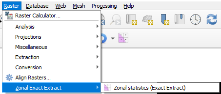
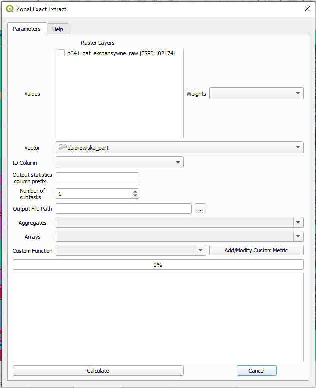

<h1 align="center">
	QGIS Zonal ExactExtract
</h1>

<h3 align="center">
	Plugin for QGIS to calculate zonal statistics using <a href="https://github.com/isciences/exactextract/tree/master">exactextract</a> library
</h3>

	<strong>
		<a href="placeholder">Docs</a>
		•
		<a href="placeholder">Demo</a>
	</strong>

## Overview
This is a repository for the QGIS plugin that allows to aggregate/summarize values of the raster over polygonal (vector) areas using ``exactextract`` library. This library allows to treat pixel cells as partially covered by polygons using weighting according to the extent of cover. If you want to know more about the library working in the backend of this plugin it's highly recommend to visit its <a href="https://github.com/isciences/exactextract/tree/master"> github repository</a>.

"Zonal statistics" tool in QGIS currently have an issues (<a href="https://github.com/qgis/QGIS/issues/52223">1</a>, <a href="https://github.com/qgis/QGIS/issues/38273">2</a>) that yield wrong results in certain situations.

### Features
- **Multiple supported statistics** Every statistic given by ``exactextract`` is supported by plugin (<a href="https://github.com/isciences/exactextract?tab=readme-ov-file#supported-statistics">statistics</a>), including array result type (usage of these statistics might slow down calculation and saving stage).
- **Usage of QGIS parallel engine** There is an option to process statistics calculation in multiple parts (subtasks/batch option). Calculation of statistics in this case is done in parallel manner using ``QgsTaskManager`` engine.
- **Support for multiband rasters** In case there's a multiband raster - each band is processed during calculations and is output as separate set of columns.

### Features to be added
- Support for weighting raster;
- Move all heavy operations to QGIS ``QgsTask``;
- Support for more output formats (including ``geoparquet``);
- Support layer choice in case of file formats with many layers (e.g. ``geopackage``);
- Remove necessity to use geopandas - requires the addition of QGIS vectors and rasters handling capabilities to ``exactextract`` python API.

## Current version
It's **beta** version of the plugin. It  is not recommended for production usage yet! 

It will be out of **beta** when:
- ``exactextract`` python package is released on PyPi;
- unit and integration tests are added;
- features are considered  completed;
- documentation is provided with the plugin;

## Installation

In current version of the plugin there are 4 packages required:
- Installed through OSGeo4W setup utility:
  - geopandas
  - pandas
- Installed through OSGeo4W shell python pip:
  - <a href="https://pypi.org/project/pyogrio/">pyogrio</a>: ``pip install pyogrio``
- Needs to be compile and installed manually from GitHub repository (``exactextract`` library author will upload it to *conda-forge* once API is stable):
  - compile <a href="https://github.com/isciences/exactextract/tree/master/python">exactextract</a> and then ``pip install`` wheel
  